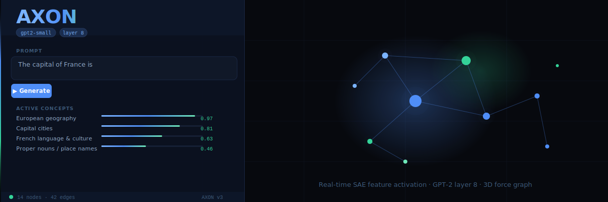
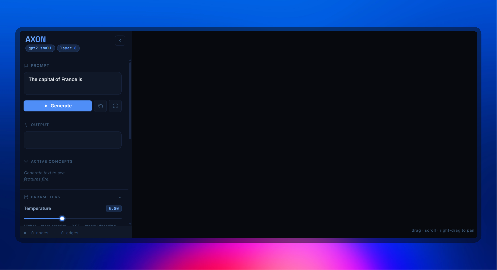

<div align="center">



# AXON

**Watch language models think — real-time 3D visualisation of internal concept activations, token by token**

Watch Sparse Autoencoder features fire inside a language model as it generates text.
Every token produced lights up concepts in a live, interactive 3D force graph.

<br/>

[](https://python.org)
[](https://pytorch.org)
[](https://fastapi.tiangolo.com)
[](https://github.com/neelnanda-io/TransformerLens)
[](https://github.com/jbloomAus/SAELens)
[](https://threejs.org)
[](LICENSE)

</div>

---

## What is this?

AXON hooks into GPT-2's residual stream at layer 8, runs each token's hidden state through a
Sparse Autoencoder (SAE), and streams the top-K firing features to a browser over WebSocket —
rendered as an evolving 3D force graph where:

- **Nodes** = SAE features (human-readable concepts from [Neuronpedia](https://neuronpedia.org))
- **Edges** = features that co-activated in the same token step
- **Node size & brightness** = activation magnitude, breathing with a decay animation
- **The graph** = a literal map of what the model is "thinking" right now

It's mechanistic interpretability made tangible — not graphs in papers, but a live window into a running LLM.

---

## Demo

> **Watch the full demo** — click the thumbnail below to play the video

[](assets/demo-axon.mp4)

<br/>

**Idle — ready to generate**



*Clean sidebar with prompt input, live parameter sliders, and the dark 3D canvas waiting.*

<br/>

**Mid-generation — graph active**


*The force graph fills with glowing nodes as tokens stream in. Each node is an SAE feature; edges connect features that fired together. Node brightness = activation strength.*

<br/>

**Feature Inspector open**


*Click any node to fly the camera to it. The inspector shows the feature index, its Neuronpedia label, current and peak activation, co-activating neighbours, and a direct link to the Neuronpedia feature page.*

---

## Architecture

```
Browser (Three.js + 3d-force-graph)
    |  WebSocket  (JSON stream, one message per token)
    v
FastAPI server  (server.py)
    |
    +-- HookedSAETransformer (TransformerLens)
    |       gpt2-small, no_processing mode
    |       hook: blocks.8.hook_resid_pre
    |
    +-- SAE encoder  (SAELens — gpt2-small-res-jb)
    |       top-K feature activations per token
    |
    +-- Neuronpedia API
            human-readable feature labels
            persisted to feature_cache.json
```

**Per-token pipeline:**

1. Append new token to sequence, run one forward pass with a single residual-stream hook
2. Extract the `[d_model]` residual vector at layer 8
3. Run SAE `.encode()` → sparse feature activations
4. Take top-K by activation value, filter below threshold
5. Fetch Neuronpedia labels in parallel (`asyncio.gather`)
6. Sample next token (temperature / top-K / top-P / rep-penalty)
7. Stream `{token, step, features[]}` to browser over WebSocket

---

## Quick Start

### Requirements

- Python 3.11
- 8 GB RAM minimum (16 GB recommended)
- GPU optional but strongly recommended — see [Enabling CUDA](#enabling-cuda)

### 1 — Clone

```bash
git clone https://github.com/09Catho/axon.git
cd axon
```

### 2 — Install

**Windows:**
```powershell
py -3.11 -m venv .venv
.\.venv\Scripts\Activate.ps1
pip install -r requirements.txt
```

**Linux / macOS:**
```bash
python3.11 -m venv .venv
source .venv/bin/activate
pip install -r requirements.txt
```

> First run downloads GPT-2 weights (~500 MB) and the SAE (~200 MB) from HuggingFace.
> Subsequent starts use the local cache and are fast.

### 3 — Run

```bash
python server.py
```

Open **http://127.0.0.1:8000** in your browser.
Type a prompt, hit **Generate**, and watch the graph come alive.

### Demo launcher (auto-opens browser)

```bash
python demo.py
```

Polls `/health` until the model finishes loading, then opens the browser automatically —
no guessing on startup time or sleep timers.

---

## Enabling CUDA

The default `requirements.txt` installs CPU-only PyTorch (~200 MB).
If you have an NVIDIA GPU with CUDA 12.1:

```bash
pip uninstall torch -y
pip install torch==2.4.1+cu121 --extra-index-url https://download.pytorch.org/whl/cu121
```

Restart `server.py`. The health endpoint confirms:
```json
{"ready": true, "device": "cuda", "cached_labels": 0}
```

**Speed comparison — GPT-2 small, 40 tokens:**

| Device | ms / token |
|---|---|
| RTX 4050 Laptop | ~35 ms |
| RTX 3090 | ~18 ms |
| Apple M2 (CPU) | ~400 ms |
| Intel i7 (CPU) | ~900 ms |

---

## Parameters

All sliders are live in the sidebar and take effect on the next Generate call:

| Parameter | Range | What it does |
|---|---|---|
| **Temperature** | 0.05 – 2.0 | Output distribution sharpness. 0.05 = greedy, 1.5+ = chaotic |
| **Top-K** | 0 – 200 | Restrict sampling to the K most likely next tokens. 0 = disabled |
| **Top-P** | 0.05 – 1.0 | Nucleus sampling — cumulative probability cutoff |
| **Repetition penalty** | 1.0 – 2.0 | Divides logits of already-seen tokens. 1.0 = off |
| **Max tokens** | 10 – 200 | Hard stop on generation length |
| **Feature top-K** | 5 – 30 | SAE features extracted per token |
| **Act. threshold** | 0.01 – 1.0 | Minimum activation to show a node (filters noise) |

**Anti-repetition recipe:** Temperature `0.9` · Top-K `40` · Repetition penalty `1.3`

---

## Graph Interaction

| Control | Action |
|---|---|
| Left-drag | Rotate |
| Scroll wheel | Zoom in / out |
| Right-drag | Pan |
| Click node | Fly camera to node + open Feature Inspector |
| Click background | Dismiss inspector, resume auto-rotate |
| **Fit** button | Zoom to fit all nodes |
| **Reset** button | Clear graph and output text |

---

## Swapping Models

AXON is model-agnostic. You need two things:
1. A **TransformerLens-supported model** (GPT-2, Pythia, Gemma, Mistral, LLaMA-2, ...)
2. A **pretrained SAE** available through SAELens for that model + layer

Edit four constants at the top of `server.py`:

```python
SAE_RELEASE = "gpt2-small-res-jb"          # SAELens release key
SAE_ID      = "blocks.8.hook_resid_pre"    # SAE id within that release
LAYER       = 8                             # layer integer
HOOK_NAME   = "blocks.8.hook_resid_pre"    # TransformerLens hook point
```

Update the model load line:

```python
model = HookedSAETransformer.from_pretrained_no_processing("gpt2-small", **model_kwargs)
#                                                            ^ model name
```

And the Neuronpedia URL for human-readable labels:

```python
NEURONPEDIA_URL = "https://www.neuronpedia.org/api/feature/gpt2-small/8-res-jb/{idx}"
```

### Supported configurations

| Model | Params | SAE release key | SAE ID pattern | Neuronpedia |
|---|---|---|---|---|
| **GPT-2 small** | 117M | `gpt2-small-res-jb` | `blocks.{L}.hook_resid_pre` | YES — layers 0-11 |
| **GPT-2 medium** | 345M | `gpt2-medium-res-jb` | `blocks.{L}.hook_resid_pre` | YES — layers 0-23 |
| **GPT-2 large** | 774M | `gpt2-large-res-jb` | `blocks.{L}.hook_resid_pre` | YES — layers 0-35 |
| **GPT-2 XL** | 1.5B | `gpt2-xl-res-jb` | `blocks.{L}.hook_resid_pre` | YES — layers 0-47 |
| **Pythia-70M** | 70M | `pythia-70m-deduped-res-sm` | `blocks.{L}.hook_resid_pre` | Partial |
| **Pythia-160M** | 160M | `pythia-160m-deduped-res-sm` | `blocks.{L}.hook_resid_pre` | Partial |
| **Pythia-410M** | 410M | `pythia-410m-deduped-res-sm` | `blocks.{L}.hook_resid_pre` | Partial |
| **Gemma-2-2B** | 2B | `gemma-scope-2b-pt-res` | `blocks.{L}.hook_resid_post` | No |

**List all available SAEs:**
```python
from sae_lens import pretrained_saes
print(pretrained_saes.get_pretrained_saes_directory())
```

**List all TransformerLens model names:**
```python
import transformer_lens
print(transformer_lens.loading_from_pretrained.get_official_model_list())
```

### Example: switch to GPT-2 medium, layer 16

```python
# server.py
SAE_RELEASE      = "gpt2-medium-res-jb"
SAE_ID           = "blocks.16.hook_resid_pre"
LAYER            = 16
HOOK_NAME        = "blocks.16.hook_resid_pre"
NEURONPEDIA_URL  = "https://www.neuronpedia.org/api/feature/gpt2-medium/16-res-jb/{idx}"

model = HookedSAETransformer.from_pretrained_no_processing("gpt2-medium", **model_kwargs)
```

> If Neuronpedia has no labels for your SAE, features display as `Feature 4821`.
> The graph works fully — you just lose human-readable descriptions.

---

## Project Structure

```
axon/
├── server.py              Backend: FastAPI + WebSocket generation loop
├── demo.py                Convenience launcher (polls /health, opens browser)
├── benchmark.py           Quality + latency checks (6 automated tests)
├── requirements.txt       Pinned Python dependencies
├── feature_cache.json     Persisted Neuronpedia label cache (auto-generated)
├── assets/
│   └── banner.svg         README banner image
└── static/
    ├── index.html         App shell + sidebar HTML
    ├── style.css          Design system (Inter + Space Grotesk + JetBrains Mono)
    └── main.js            3D graph, WebSocket client, OrbitControls, inspector
```

---

## Benchmark

```bash
python benchmark.py
```

Six automated checks run against the live server:

| # | Check | Pass condition |
|---|---|---|
| 1 | **Activation sanity** | "France" prompt fires geography / capital / European concepts |
| 2 | **Consistency** | Same prompt — identical top features across 3 runs (greedy decode) |
| 3 | **Stress test** | 20 tokens generated without crash |
| 4 | **Latency** | ms/token reported; warns if over threshold for device |
| 5 | **Edge cases** | Single-token prompt, math expression, code snippet |
| 6 | **Contrast** | Code prompt vs creative writing has less than 50% feature overlap |

---

## WebSocket API

### `GET /health`
```json
{"ready": true, "device": "cpu", "cached_labels": 1842}
```

### `WS /ws` — send
```json
{
  "prompt": "The capital of France is",
  "max_tokens": 40,
  "temperature": 0.8,
  "top_k": 50,
  "top_p": 0.9,
  "repetition_penalty": 1.1,
  "feat_k": 15,
  "act_threshold": 0.1
}
```

### `WS /ws` — receive (one per token)
```json
{
  "token": " Paris",
  "step": 0,
  "features": [
    {"id": 4821, "label": "European geography", "activation": 14.3, "layer": 8},
    {"id": 1203, "label": "Capital cities",     "activation": 11.7, "layer": 8}
  ]
}
```

Final message when complete: `{"status": "done"}`

---

## Tech Stack

| Layer | Technology |
|---|---|
| Language model | GPT-2 via [TransformerLens](https://github.com/neelnanda-io/TransformerLens) |
| Sparse Autoencoder | [Joseph Bloom's gpt2-small-res-jb](https://github.com/jbloomAus/mats_sae_training) via [SAELens](https://github.com/jbloomAus/SAELens) |
| Feature labels | [Neuronpedia](https://neuronpedia.org) API |
| Backend | [FastAPI](https://fastapi.tiangolo.com) + [Uvicorn](https://www.uvicorn.org) |
| Streaming | WebSocket |
| 3D graph | [3d-force-graph](https://github.com/vasturiano/3d-force-graph) + [Three.js r160](https://threejs.org) |
| Fonts | Inter, Space Grotesk, JetBrains Mono via Google Fonts |

---

## Acknowledgements

- [Joseph Bloom](https://github.com/jbloomAus) — pretrained SAEs and SAELens library
- [Neel Nanda](https://github.com/neelnanda-io) — TransformerLens
- [Neuronpedia](https://neuronpedia.org) — feature label database
- [Vasco Aturiano](https://github.com/vasturiano) — 3d-force-graph

---

<div align="center">

Built for mechanistic interpretability research and education.

</div>
